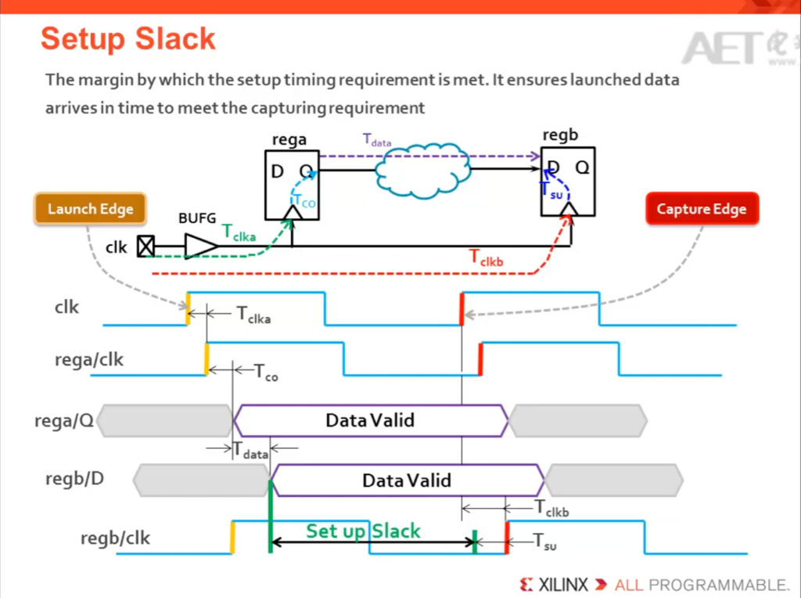
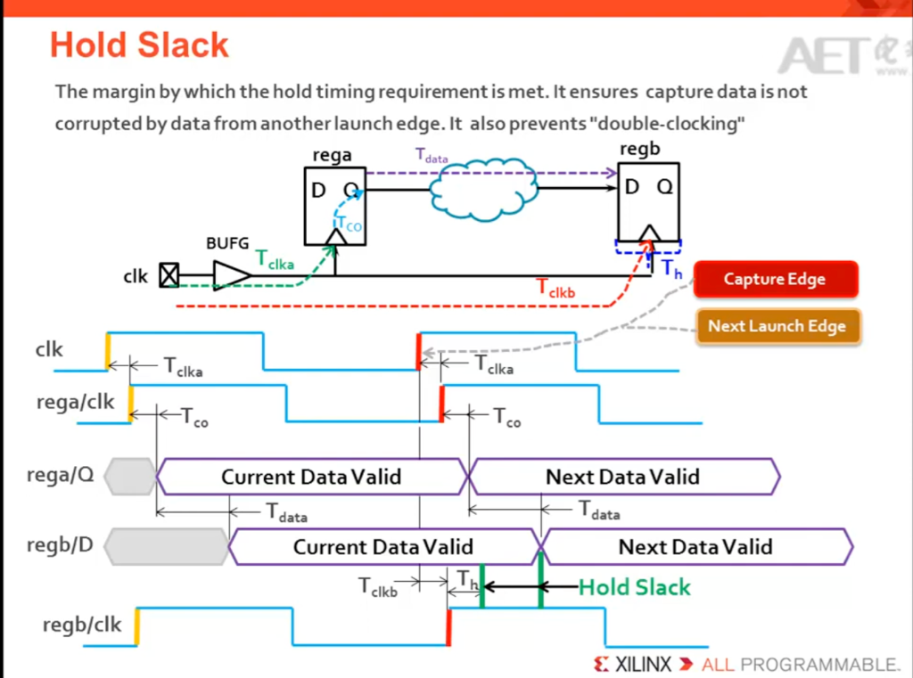

# Setup / Hold Time 深入解析

## Part 1: ASIC/FPGA 重點筆記

### 1. 核心觀念修正 (The Missing Piece)

**Setup Check (建立時間)**
- 檢查資料是否跑得夠快，能在下一個 Clock Edge 之前趕到
- 既然是「下一個」，公式裡必須包含 Clock Period ($T_{period}$)

**Hold Check (保持時間)**
- 檢查資料是否跑得夠慢，不會衝太快蓋掉當前要鎖存的資料（防止 Race Condition）
- 這跟 Clock 頻率無關

---

### 2. 公式懶人包 (記憶版)

**我們定義：**
- **Data Path (資料跑多久)** = $T_{clk\_a} + T_{clk\to q} + T_{comb}$
- **Clock Skew (時鐘偏差)** = $T_{clk\_b} - T_{clk\_a}$ (Capture Latency - Launch Latency)

#### 比較表

| 項目 | Setup Time (建立時間) | Hold Time (保持時間) |
|------|---------------------|-------------------|
| **口訣** | 跟時間賽跑 (Max Delay) | 跟新資料賽跑 (Min Delay) |
| **檢查目標** | 資料不能太慢 (Late) | 資料不能太快 (Early) |
| **關鍵公式** | $T_{data\_path} < T_{period} + T_{skew} - T_{setup}$ | $T_{data\_path} > T_{skew} + T_{hold}$ |
| **Slack 計算** | $Req - Arr$   $(T_{period} + T_{skew} - T_{setup}) - T_{data\_path}$ | $Arr - Req$   $T_{data\_path} - (T_{skew} + T_{hold})$ |
| **Violation 解法** | 1. 降低頻率 ($T_{period} \uparrow$)   2. 減少 Logic Delay ($T_{comb} \downarrow$)   3. 換快一點的 Cell (LVT) | 1. 插入 Buffer (Delay $\uparrow$)   2. 繞遠路 (Detour)   3. 不能靠降頻解決 |

---

### 3. 為什麼 Skew 是 $b - a$ (Capture - Launch)？

這是因為我們在乎的是「**Capture Clock (終點裁判)**」相對於「**Launch Clock (起跑槍聲)**」晚了多久響起。

#### Setup 情境 (對 Setup 有利)

如果你是跑者 (Data)，你需要趕在終點線關門前到達。

- 若 $T_{clk\_b}$ (終點裁判) 比 $T_{clk\_a}$ (起跑槍聲) 晚到，代表終點線關門的時間延後了
- 這給了你更多時間去跑
- 所以 **Positive Skew** ($T_{clk\_b} > T_{clk\_a}$) 會 **增加 Setup Slack (變好)**

> 💡 **記憶點**：終點晚點關門，我就不用跑那麼累。

#### Hold 情境 (對 Hold 有害)

Hold 規定你不能太早衝過頭干擾下一次比賽。

- 若 $T_{clk\_b}$ (終點裁判) 晚到，代表資料需要維持 (Hold) 的時間變長了
- 這讓你更容易違規 (太早放掉資料)
- 所以 **Positive Skew** ($T_{clk\_b} > T_{clk\_a}$) 會 **減少 Hold Slack (變差)**

> 💡 **記憶點**：裁判遲遲不吹哨，我就得撐著動作更久，好累。

---

### 4. 常見誤區與觀念修正 (Debug Note)

#### 1. Setup Time (建立時間) ❌ 這裡有一個致命缺失

**你的原始公式：**
$$T_{clk\_b} - T_{setup} - T_{uncertainty} > T_{clk\_a} + T_{clk\to q} + T_{comb}$$
*(移項後)：*
$$Clock\_Skew - Data\_Delay - T_{setup} > 0$$

🔴 **你的問題出在哪？**
你漏掉了 **Clock Period ($T_{period}$)**。
你把 Setup Check 當成了「同一個 Clock Edge」的檢查，但 Setup Check 是 **跨週期** 的。

**為什麼這樣是錯的？**
照你的公式：Clock_Skew (通常很小，甚至接近 0) 必須大於 Data_Delay (Logic 跑的時間，通常很長)。
結果：如果不加 $T_{period}$，你的公式意思變成「資料必須在瞬間（甚至負時間）內跑完」，這在物理上是不可能的。除非你的 Logic Delay 是 0，否則這個不等式永遠不會成立，你的晶片永遠無法通過 Timing Check。

**正確的物理意義：**
Launch F/F 在 $t=0$ 發出資料。Capture F/F 是在 $t = T_{period}$ (下一個週期) 等待資料。
所以你的「本錢」是 **一個週期的時間 ($T_{period}$)**，外加 Skew。

✅ **修正後的公式：**
$$T_{period} + T_{clk\_b} - T_{setup} > T_{clk\_a} + T_{clk\to q} + T_{comb}$$
*(移項後)：*
$$T_{period} + Clock\_Skew - Data\_Delay - T_{setup} > 0$$

> 💡 **結論**：Setup 就像「趕飛機」。你的公式算成了飛機已經起飛了你才出發。正確公式是：你有「起飛時間 + 航程時間 ($T_{period}$」這麼長的時間可以慢慢跑。

#### 2. Hold Time (保持時間) ✅ 你的邏輯是正確的

**你的原始公式：**
$$T_{clk\_a} + T_{clk\to q} + T_{comb} > T_{clk\_b} + T_{hold} + T_{uncertainty}$$
*(移項後)：*
$$Data\_Delay - Clock\_Skew - T_{hold} > 0$$

🔵 **你的理解是對的！**
為什麼這題你對了？因為 Hold Check 通常是檢查 **同一個 Clock Edge** (Launch @ $t=0$, Capture @ $t=0$)。
我們要確保：新的資料不要跑得比時鐘訊號還快，導致它在當前週期就衝進去，蓋掉原本的資料。
所以這裡不需要 $T_{period}$，純粹是 Delay 與 Skew 的比拚。

> 💡 **小提醒**：雖然數學對了，但觀念描述上稍微修正一下：這不是指「下一筆 Transaction」，而是指「當前這個 Edge 觸發所發射的新資料」，不能跑太快去汙染到「當前這個 Edge 本來要鎖住的舊資料」。

---

## Part 2: English Interview Simulation (Q&A)

這部分是模擬外商 (Apple/NVIDIA/AMD) 面試時的對答。

### Q1: Can you explain the difference between Setup time and Hold time?

**Suggested Answer:**

"Sure.

**Setup time** is the minimum amount of time the data signal must be stable **before** the capturing clock edge arrives. If the data arrives too late, we get a setup violation. It effectively sets the maximum operating frequency of the chip.

**Hold time**, on the other hand, is the minimum time the data must remain stable **after** the capturing clock edge. If the data changes too quickly and interferes with the current latching value, we get a hold violation. Unlike setup time, hold time is independent of the clock frequency."

---

### Q2: Write down the equation for Setup and Hold slack. How does clock skew affect them?

*(面試官通常會給你白板或共享螢幕)*

**Suggested Answer:**

"Let's define $T_{launch}$ and $T_{capture}$ as the clock insertion delays.

**For Setup Slack**, the equation is:

$$Slack_{setup} = (T_{period} + T_{capture} - T_{setup}) - (T_{launch} + T_{clk2q} + T_{comb})$$

**For Hold Slack**, the equation is:

$$Slack_{hold} = (T_{launch} + T_{clk2q} + T_{comb}) - (T_{capture} + T_{hold})$$

Regarding **Clock Skew** (defined as $T_{capture} - T_{launch}$):

- A **positive skew** (where capture clock is later than launch clock) is **good for Setup** because it relaxes the required arrival time.
- However, it is **bad for Hold** because it requires the data to be stable for a longer duration after the clock edge."

---

### Q3: If you have a Setup violation, how do you fix it? What about Hold?

**Suggested Answer:**

"**For Setup violations**, I can:

1. Optimize the combinational logic (reduce logic levels).
2. Upsize the driver cells to improve drive strength.
3. Use lower threshold voltage (LVT) cells, which are faster but leakier.
4. Pull in the launch clock or push out the capture clock (Useful Skew).

**For Hold violations**, I typically:

1. Insert buffers or delay cells into the data path to slow it down.
2. Downsize cells to increase delay (though less common for hold fixing).

It's important to note that fixing hold usually adds delay, so we must be careful not to create a new setup violation."

---

## 重點整理

### Setup Time 關鍵字
- Max Delay
- 跟頻率有關
- 太慢會違規
- 用快速 Cell、減少邏輯層級解決

### Hold Time 關鍵字
- Min Delay
- 跟頻率無關
- 太快會違規
- 加 Buffer、增加延遲解決

### Clock Skew 影響
- Positive Skew ($T_{capture} > T_{launch}$)
  - ✅ Setup Slack 增加（變好）
  - ❌ Hold Slack 減少（變差）
- Negative Skew ($T_{capture} < T_{launch}$)
  - ❌ Setup Slack 減少（變差）
  - ✅ Hold Slack 增加（變好）
